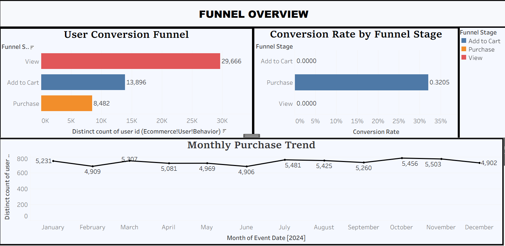
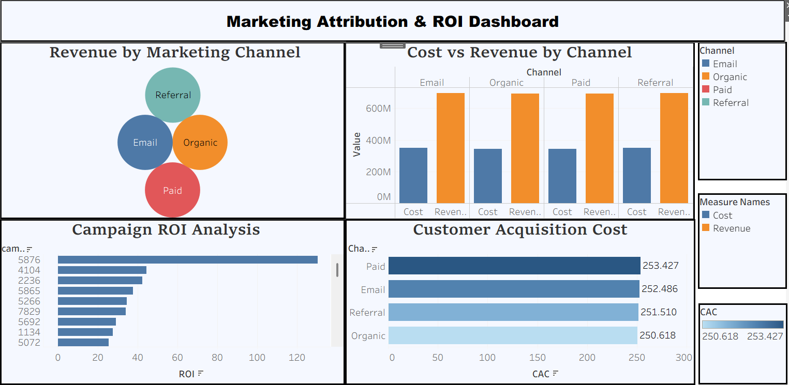
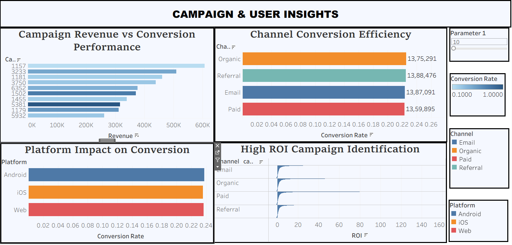

# 📊 Marketing Funnel & Attribution Analysis Dashboard

---

## 📌 Project Overview

This project presents an **end-to-end Marketing Funnel & Attribution Analytics Dashboard** built using **Tableau**.

The dashboard analyzes user journey data, marketing campaign performance, and website traffic behavior to understand:

* Funnel conversion performance (View → Cart → Purchase)
* Campaign effectiveness and ROI
* Customer acquisition cost (CAC)
* Traffic source and device impact
* Revenue contribution by marketing channel
* Conversion trends over time

The goal of this project is to demonstrate how **data-driven marketing insights** can improve campaign strategy, optimize spending, and increase conversion efficiency.

---

## 📊 Dataset Summary

* Event-level user interaction data
* Campaign-level marketing performance data
* Website traffic & session analytics
* Relational model using bridge table

📌 *Note:*
The dataset simulates real-world digital marketing analytics with multi-table relationships.

---

## 🧾 Key Data Attributes

* user_id & campaign_id (relational keys)
* event_type (view, cart, purchase)
* campaign channel & platform
* impressions, clicks, conversions
* marketing cost & revenue
* sessions & page views
* device and traffic source
* event & session dates

---

## 🛠️ Tools & Technologies Used

* **Tableau Desktop** – Dashboard creation & visualization
* **Relational Data Modeling** – Multi-table relationships
* **Calculated Fields** – Conversion rate, ROI, CAC, funnel metrics

---

## 📈 Dashboard Overview

The project includes **four interactive dashboards**, each focused on a different marketing performance dimension.

---

## 🖼️ Dashboard Previews

### 🔹 Funnel Overview Dashboard

This dashboard monitors user progression across funnel stages and identifies drop-off points. It helps evaluate overall funnel health and conversion efficiency.

---

### 🔹 Marketing Attribution & ROI Dashboard

This dashboard analyzes campaign performance, revenue contribution, ROI, and customer acquisition cost. It helps measure marketing effectiveness and profitability.

---

### 🔹 Traffic & Platform Performance Dashboard

This dashboard evaluates traffic quality, device performance, and session-to-conversion relationships. It helps understand which sources and platforms drive better results.

---

### 🔹 Campaign & User Insights Dashboard

This dashboard provides deeper insights into campaign-wise conversion, revenue performance, and user behavior patterns across funnel stages.

---

## 🔍 Key Insights

### 📌 Funnel Performance Insights

* Identified key drop-off stages in the user journey
* Conversion efficiency varies across campaigns
* Funnel health directly impacts overall revenue

---

### 📊 Marketing & ROI Insights

* Certain campaigns generate significantly higher ROI
* High marketing spend does not always guarantee higher revenue
* Lower CAC channels deliver better profitability

---

### 🌐 Traffic & Platform Insights

* Traffic sources differ in conversion efficiency
* Device performance influences user behavior
* Session volume does not always correlate with higher conversions

---

## 🧠 Key Takeaways

* Optimizing funnel stages improves overall marketing performance
* ROI and CAC are critical for evaluating campaign success
* Traffic quality matters more than traffic quantity
* Structured dashboards enable better strategic decisions
